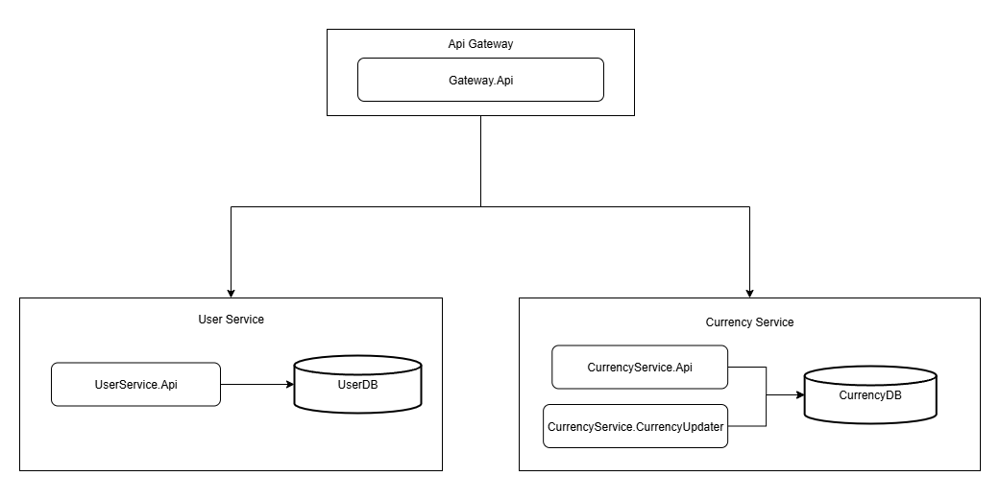

# TrueCode
Микросервисное решение, позволяющее добавлять в избранное и просматривать актуальные курсы валют.

## Getting started
- Склонируйте репозиторий
- В VisualStudio запустите проект в конфигурации docker-compose
- В браузере автоматически откроется страница со SwaggerUI

## Description
### CurrencyService 
Отвечает за все операции, связанные с валютами.  
Обновлением таблицы валют занимается Worker - CurrencyUpdater. Данные забираются с сайта http://www.cbr.ru/scripts/XML_daily.asp . Интервал обновления настраивается из конфигурации (по умолчанию 1 минута).
gRPC API позволяет добавлять валюту в избранное, а также просматривать свой список избранного.

### UserService 
Отвечает за аутентификацию и авторизацию пользователей с помощью JWT, хранит данные аккаунтов и пароли. Используется ASP.NET Core Identity.
gRPC API позволяет добавлять осуществлять логин и регистрацию.

### Gateway
Является шлюзом для вышеперечисленных микросервисов. Конвертирует REST запросы в gRPC.

### Migrations
Для удобного локального развертывания, миграции выполняются автоматически при создании контекста БД. В production среде миграции будут запускаться в CI/CD пайплайне, а строки Database.Migrate будут удалены.

### Tests
Также в решении присутствуют сборки с unit-тестами для доменных сущностей и use-case'ов. Находятся в папке /tests.

--------------

## License

This project is licensed under the **Apache License**. This means that you can use, modify and distribute it freely. See [http://www.apache.org/licenses/LICENSE-2.0.html](http://www.apache.org/licenses/LICENSE-2.0.html) for more details.
